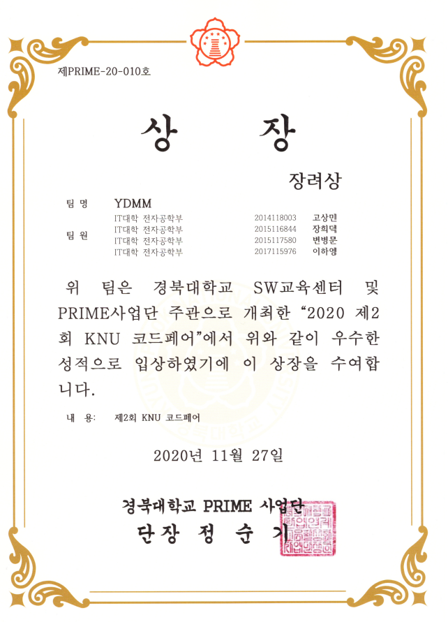

**본 폴더는 2020 코드페어 관련 폴더입니다.**  

### 2020 코드페어
 > 졸업프로젝트를 통해 진행된 [자율주행 공기청정기](https://github.com/Byung-moon/airmate)라는 주제로 참가하였습니다.  
 
   
     
     
 > 프로젝트 폴더 : https://github.com/Byung-moon/airmate
 
 
  
  
   
   
   
   
   
### 참가 내용

**스스로 주행을 하며 실내공간의 공기를 청정하게 유지**시켜주는 가전로봇을 제작한다. 
로봇은 LIDAR 센서를 기반으로 주변환경과 로봇 자신의 위치를 인식할 수 있고, 주행 중 나타나는 장애물을 탐지하여 회피주행을 할 수 있다. 사용자는 실내공간에서 공기청정을 필요로 하는 공간을 어플리케이션에서 우선순위에 맞게 설정할 수 있고, 로봇은 사용자의 우선순위에 따라 공간을 주행하며 공기를 청정시켜 준다. 이를 통해 기존의 고정적인 공기 청정기와는 달리 자율주행을 통한 실내 모든 공간을 정화함으로써, 보다 적은 비용으로 더 많은 지역을 공기청정할 수 있는 장점이 있다.  

사용자에게는 경제적 부담을 줄여줄 것이며, 기술력을 통한 공기청정기 시장 진입이 가능할 것으로 생각된다. 또한, 개인용 로봇의 자율 주행 기능을 선보이며, 사용자 인터페이스인 어플리케이션을 통해 사용자의 공기청정 정보를 제공받을 수 있다. 이러한 공기청정 로봇의 보급은 미래의 생활가전 형태를 완전히 뒤바꿔 놓을 것이다.
  
  
  
  
  
  
  
### 결과  
  
> **우수상 수상**

